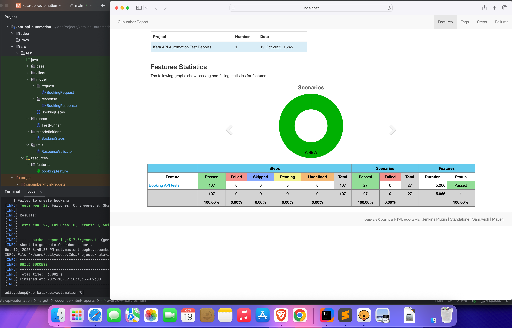
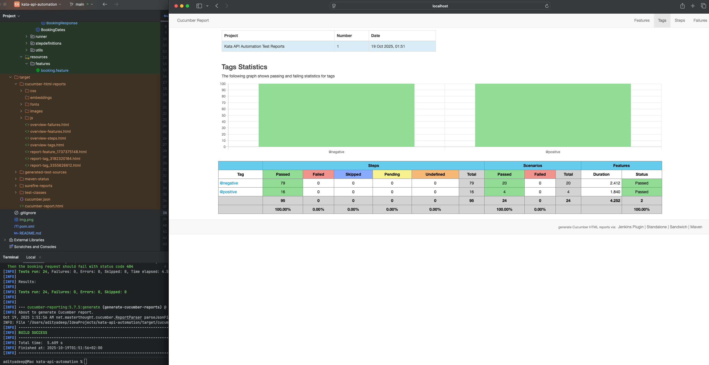

Project Overview:
This is an API automation testing framework based on Rest-Assured and Cucumber using Java as programming language.
to test hotel booking website
Prerequisites
1. Java Development Kit (JDK) 21 or higher
2. Apache Maven (3.6.3 or higher)
3. Any IDE (e.g., IntelliJ IDEA, Eclipse)

Setup and Installation
1. Clone the Repository 
   git clone: https://github.com/aditya-deep/kata-api-automation.git
2. Navigate to the project directory 
   cd api-testing-framework
3. Install Dependencies
   mvn clean install 

**Run Tests**
There are 2 ways to run the tests:
1. Right-click on the 'TestRunner' class located in the 'src/test/java/runner' directory and hit 'Run'.
Note: To run only the specific scenarios (@positive, @negative), modify the 'tags' option in the 'TestRunner' class.

2. Using Maven from the command line:
   a. Open a terminal and navigate to the project directory.
   b. Execute `mvn test` the following command to run all tests via maven
   c. To run specific tagged scenarios, use the following command:
      `mvn test -Dcucumber.filter.tags="@negative"`

**Reporting**
1. After test execution, the HTML report will be generated at:
    `target/cucumber-report.html`
To view the report, open the file in a web browser.

2. The Framework also generates an advanced report using the 'maven-cucumber-reporting' plugin and the report can be found at:
    `target/cucumber-html-reports/overview-features.html`
3. Sample Report Screenshot:

The report includes:
Summary of scenarios passed/failed
Detailed step-level results
Error messages and stack traces for failures
Graphs and trends (if multiple runs are configured)